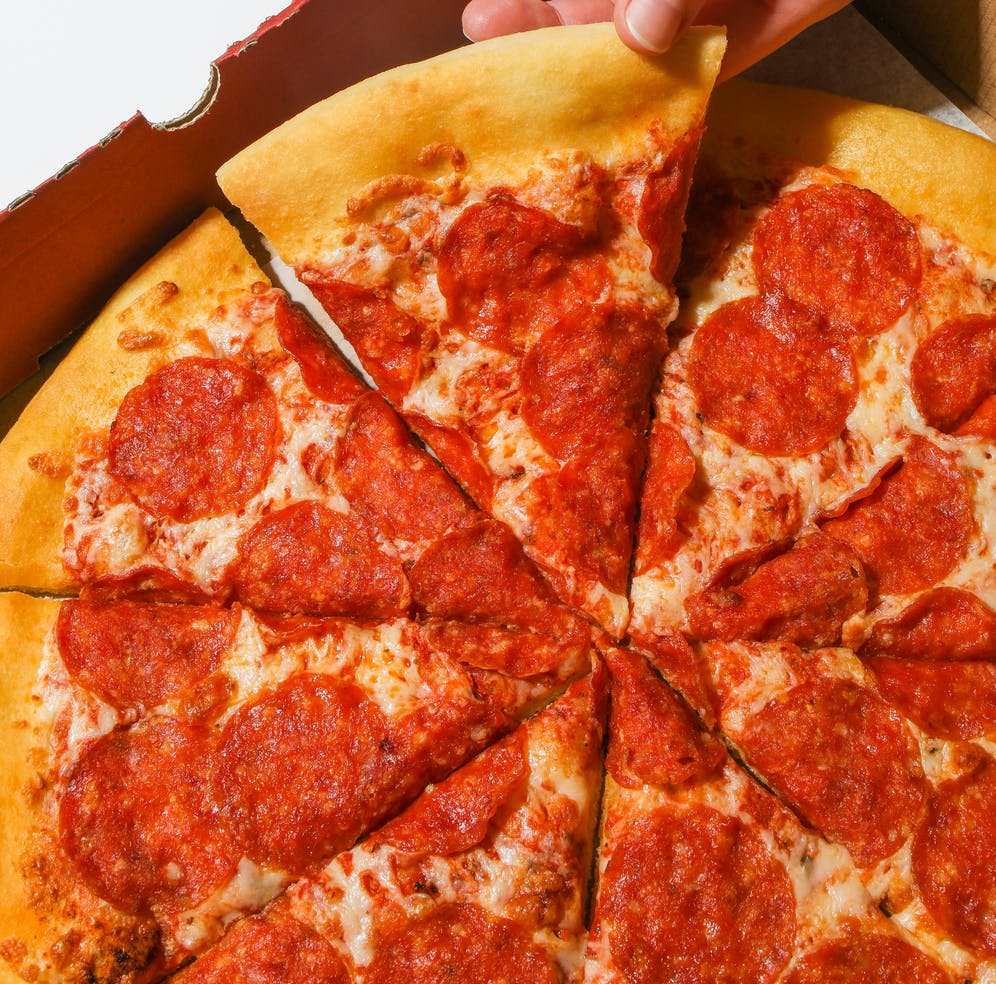

---
# Feel free to add content and custom Front Matter to this file.
# To modify the layout, see https://jekyllrb.com/docs/themes/#overriding-theme-defaults

layout: default
title: Home
---

    

        

            

                

                    <h3>Cheese Pizza</h3>
                    
sample description

                

                

                    
                

            

        

        
e

    

